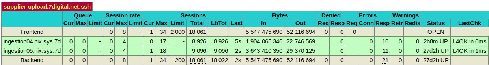
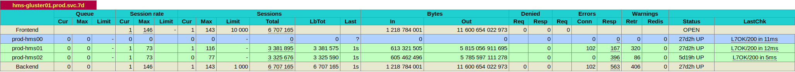
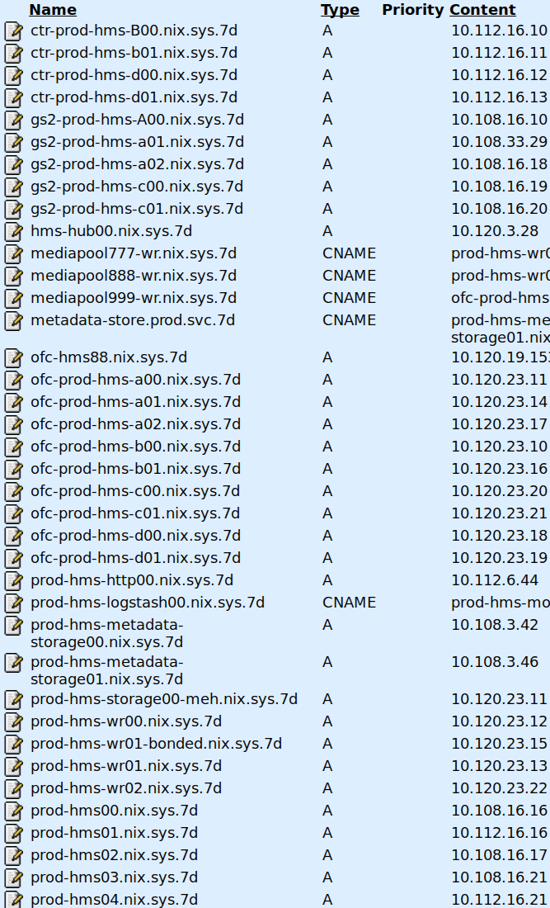

% Techtalk
% Gluster in 7d
% October 07, 2016

# What's Gluster?

"GlusterFS is a scalable network filesystem. Using common off-the-shelf 
hardware, you can create large, distributed storage solutions for media 
streaming, data analysis, and other data- and bandwidth-intensive tasks."

-- https://www.gluster.org/

# Where do we use it? 

- Mediapool 777 & 888
- Supplier uploads
- Ingestion Share (new starfox) 

# Why do we use it?

- Redundancy on the cheap in the pre GCS world
- Less complex than legacy mediapools*
- *_In Theory_

# Simple use case

- Supplier uploads
- 
- ~~~~~~~~~~~~~~~~~~~~~~~~~~~~~~~~~~~~~~~~~~
root@ingestion05:~# gluster vol info
Volume Name: supplier-upload
Type: Replicate
Volume ID: 01cec521-7331-4b29-a90e-e23a823297e3
Status: Started
Number of Bricks: 1 x 2 = 2
Transport-type: tcp
Bricks:
Brick1: ingestion04:/export/brick00/supplier-upload
Brick2: ingestion05:/export/brick00/supplier-upload
~~~~~~~~~~~~~~~~~~~~~~~~~~~~~~~~~~~~~~~~~~
 
# What it looks like

- ~~~~~~~~~~~~~~~~~~~~~~~~~~~~~~~~~~~~~~~~~~
ops@ingestion05:~$ tail -2 /proc/mounts
/dev/mapper/debian-brick00 /export/brick00 ext4 \
rw,noatime,user_xattr,barrier=1,data=ordered 0 0
ingestion05:/supplier-upload /srv fuse.glusterfs \
rw,relatime,user_id=0,group_id=0,default_permissions,allow_other,max_read=131072 0 0
~~~~~~~~~~~~~~~~~~~~~~~~~~~~~~~~~~~~~~~~~~

- ~~~~~~~~~~~~~~~~~~~~~~~~~~~~~~~~~~~~~~~~~~
[ftpadmin]
     comment = FTP Share Directory
     path = /srv/ftp
~~~~~~~~~~~~~~~~~~~~~~~~~~~~~~~~~~~~~~~~~~

# What it looks like (cont.)
- ~~~~~~~~~~~~~~~~~~~~~~~~~~~~~~~~~~~~~~~~~~
root@ingestion05:/export/brick00/supplier-upload/ftp# ls -t | head
tunecore
theorchard
consolidated
FUGA
fuga_guvera
kontor
sonyset
believe
sonyhd
labelworx
root@ingestion05:/srv/ftp# ls -t | head 
theorchard
kontor
tunecore
consolidated
FUGA
fuga_guvera
sonyset
believe
sonyhd
labelworx
~~~~~~~~~~~~~~~~~~~~~~~~~~~~~~~~~~~~~~~~~~

# More complex use case

- mp777
-  
- ~~~~~~~~~~~~~~~~~~~~~~~~~~~~~~~~~~~~~~~~~~
ops@prod-hms01:~$ df -h 
Filesystem               Size  Used Avail Use% Mounted on
rootfs                   7.3G  1.5G  5.5G  21% /
udev                      10M     0   10M   0% /dev
tmpfs                    397M  2.2M  395M   1% /run
/dev/mapper/debian-root  7.3G  1.5G  5.5G  21% /
tmpfs                    5.0M     0  5.0M   0% /run/lock
tmpfs                    794M     0  794M   0% /run/shm
/dev/vda1                228M   20M  197M  10% /boot
ctr-prod-hms-b00:/gv01   610T  606T  3.4T 100% /srv/gv01
~~~~~~~~~~~~~~~~~~~~~~~~~~~~~~~~~~~~~~~~~~

# Complex (cont.)

- ~~~~~~~~~~~~~~~~~~~~~~~~~~~~~~~~~~~~~~~~~~
ops@prod-hms01:~$ grep gv01 /etc/fstab
ctr-prod-hms-b00:/gv01 /srv/gv01 glusterfs \
defaults,_netdev,backupvolfile-server=ctr-prod-hms-b01 0 0
~~~~~~~~~~~~~~~~~~~~~~~~~~~~~~~~~~~~~~~~~~

- 

# Complex (cont. 2)

- ~~~~~~~~~~~~~~~~~~~~~~~~~~~~~~~~~~~~~~~~~~
root@ctr-prod-hms-b00:~# gluster vol info
Volume Name: gv01
Type: Distributed-Replicate
Volume ID: 94cff867-4a2c-4cc3-9a9b-8033623d49b6
Status: Started
Number of Bricks: 25 x 2 = 50
Transport-type: tcp
Bricks:
Brick1: ofc-prod-hms-b00:/export/brick000
Brick2: ctr-prod-hms-b00:/export/brick000
Brick3: ofc-prod-hms-b00:/export/brick001
Brick4: ctr-prod-hms-b00:/export/brick001
Brick5: ofc-prod-hms-b00:/export/brick002
Brick6: ctr-prod-hms-b00:/export/brick002
Brick7: ofc-prod-hms-b00:/export/brick003
Brick8: ctr-prod-hms-b00:/export/brick003
Brick9: ofc-prod-hms-b00:/export/brick004
Brick10: ctr-prod-hms-b00:/export/brick004
Brick11: gs2-prod-hms-a00:/export/brick000
Brick12: ofc-prod-hms-a00:/export/brick000
Brick13: gs2-prod-hms-a00:/export/brick001
Brick14: ofc-prod-hms-a00:/export/brick001
Brick15: gs2-prod-hms-a00:/export/brick002
~~~~~~~~~~~~~~~~~~~~~~~~~~~~~~~~~~~~~~~~~~

# Complex (cont. 3)
~~~~~~~~~~~~~~~~~~~~~~~~~~~~~~~~~~~~~~~~~~
Brick38: ofc-prod-hms-b01:/export/brick003
Brick39: ctr-prod-hms-b01:/export/brick004
Brick40: ofc-prod-hms-b01:/export/brick004
Brick41: gs2-prod-hms-a02:/export/brick000
Brick42: ofc-prod-hms-a02:/export/brick000
Brick43: gs2-prod-hms-a02:/export/brick001
Brick44: ofc-prod-hms-a02:/export/brick001
Brick45: gs2-prod-hms-a02:/export/brick002
Brick46: ofc-prod-hms-a02:/export/brick002
Brick47: gs2-prod-hms-a02:/export/brick003
Brick48: ofc-prod-hms-a02:/export/brick003
Brick49: gs2-prod-hms-a02:/export/brick004
Brick50: ofc-prod-hms-a02:/export/brick004
Options Reconfigured:
cluster.self-heal-daemon: off
cluster.data-self-heal: off
cluster.metadata-self-heal: off
cluster.entry-self-heal: off
~~~~~~~~~~~~~~~~~~~~~~~~~~~~~~~~~~~~~~~~~~

# Complex (cont. 4)
- ~~~~~~~~~~~~~~~~~~~~~~~~~~~~~~~~~~~~~~~~~~
root@prod-hms01:~# netstat -natp| grep glusterfs | head
tcp        0      0 10.112.16.16:935        10.120.23.11:49182      ESTABLISHED 1917/glusterfs  
tcp        0      0 10.112.16.16:928        10.120.23.11:49186      ESTABLISHED 1917/glusterfs  
tcp        0      0 10.112.16.16:956        10.120.23.10:49155      ESTABLISHED 1917/glusterfs  
tcp        0      0 10.112.16.16:969        10.108.16.10:49185      ESTABLISHED 1917/glusterfs  
tcp        0      0 10.112.16.16:926        10.112.16.11:49153      ESTABLISHED 1917/glusterfs  
tcp        0      0 10.112.16.16:944        10.120.23.17:49155      ESTABLISHED 1917/glusterfs  
tcp        0      0 10.112.16.16:958        10.108.33.29:49154      ESTABLISHED 1917/glusterfs  
tcp        0      0 10.112.16.16:947        10.120.23.17:49152      ESTABLISHED 1917/glusterfs  
tcp        0      0 10.112.16.16:929        10.120.23.11:49185      ESTABLISHED 1917/glusterfs  
tcp        0      0 10.112.16.16:961        10.120.23.10:49152      ESTABLISHED 1917/glusterfs  
root@prod-hms01:~# netstat -natp| grep glusterfs | wc -l
51
~~~~~~~~~~~~~~~~~~~~~~~~~~~~~~~~~~~~~~~~~~

# Issues
- ~~~~~~~~~~~~~~~~~~~~~~~~~~~~~~~~~~~~~~~~~~
ops@prod-hms03:~$ ls -l /srv/gv02/hms/track/000/049/009/850/17
---------T 1 root root 0 Nov  4  2015 /srv/gv02/hms/track/000/049/009/850/17
~~~~~~~~~~~~~~~~~~~~~~~~~~~~~~~~~~~~~~~~~~

# Issues (cont.)
- ~~~~~~~~~~~~~~~~~~~~~~~~~~~~~~~~~~~~~~~~~~
Track: 45086687, 17
gv02: gs2-prod-hms-c00.nix.sys.7d
On 2 brick(s)
Result 0: -rw-rw-r-- 2 www-data www-data 5080970 May  5  2015 /export/brick002/gv02/hms/track/000/045/086/687/17
Brick brick002 owner: www-data size: 5080970
Result 1: -rw-rw-r-- 2 www-data www-data 5080970 May  5  2015 /export/brick003/gv02/hms/track/000/045/086/687/17
Brick brick003 owner: www-data size: 5080970
gv02: ctr-prod-hms-d00.nix.sys.7d
On 1 brick(s)
Result 0: ---------T 2 root root 0 Jul 23 06:43 /export/brick001/gv02/hms/track/000/045/086/687/17
Brick brick001 owner: root size: 0
gv02: gs2-prod-hms-c01.nix.sys.7d
On 1 brick(s)
Result 0: ---------T 2 root root 0 Dec 30  2015 /export/brick001/gv02/hms/track/000/045/086/687/17
Brick brick001 owner: root size: 0
gv02: ofc-prod-hms-d00.nix.sys.7d
On 1 brick(s)
Result 0: ---------T 2 root root 0 Jul 23 06:43 /export/brick001/gv02/hms/track/000/045/086/687/17
Brick brick001 owner: root size: 0
gv02: ofc-prod-hms-c00.nix.sys.7d
On 2 brick(s)
Result 0: -rw-rw-r-- 2 www-data www-data 5080970 May  5  2015 /export/brick002/gv02/hms/track/000/045/086/687/17
Brick brick002 owner: www-data size: 5080970
Result 1: -rw-rw-r-- 2 www-data www-data 5080970 May  5  2015 /export/brick003/gv02/hms/track/000/045/086/687/17
Brick brick003 owner: www-data size: 5080970
gv02: ofc-prod-hms-c01.nix.sys.7d
On 1 brick(s)
Result 0: ---------T 2 root root 0 Dec 30  2015 /export/brick001/gv02/hms/track/000/045/086/687/17
Brick brick001 owner: root size: 0
On 6 servers and 8 bricks, suggested actions: 
ofc-prod-hms-c00.nix.sys.7d: cp /export/brick003/gv02/hms/track/000/045/086/687/17 /tmp/tmp.JD2j8fnkHM
gs2-prod-hms-c00.nix.sys.7d: rm /export/brick002/gv02/hms/track/000/045/086/687/17
gs2-prod-hms-c00.nix.sys.7d: rm /export/brick003/gv02/hms/track/000/045/086/687/17
ctr-prod-hms-d00.nix.sys.7d: rm /export/brick001/gv02/hms/track/000/045/086/687/17
gs2-prod-hms-c01.nix.sys.7d: rm /export/brick001/gv02/hms/track/000/045/086/687/17
ofc-prod-hms-d00.nix.sys.7d: rm /export/brick001/gv02/hms/track/000/045/086/687/17
ofc-prod-hms-c00.nix.sys.7d: rm /export/brick002/gv02/hms/track/000/045/086/687/17
ofc-prod-hms-c00.nix.sys.7d: rm /export/brick003/gv02/hms/track/000/045/086/687/17
ofc-prod-hms-c01.nix.sys.7d: rm /export/brick001/gv02/hms/track/000/045/086/687/17
ofc-prod-hms-c01.nix.sys.7d: rm /srv/gv02/hms/track/000/045/086/687/17
ofc-prod-hms-c00.nix.sys.7d: install -g www-data -o www-data -m 664  /tmp/tmp.JD2j8fnkHM /srv/gv02/hms/track/000/045/086/687/17
ofc-prod-hms-c00.nix.sys.7d: rm /tmp/tmp.JD2j8fnkHM
~~~~~~~~~~~~~~~~~~~~~~~~~~~~~~~~~~~~~~~~~~

# Fixes
- ~~~~~~~~~~~~~~~~~~~~~~~~~~~~~~~~~~~~~~~~~~
12:53:54-ccoffey@ciaranc:~/hms/code (master)$ python ./gluster_heal.py 
58 broken file(s) reported
15 actually broken
15 file(s) fixed, 0 not fixed
~~~~~~~~~~~~~~~~~~~~~~~~~~~~~~~~~~~~~~~~~~

# Questions?
